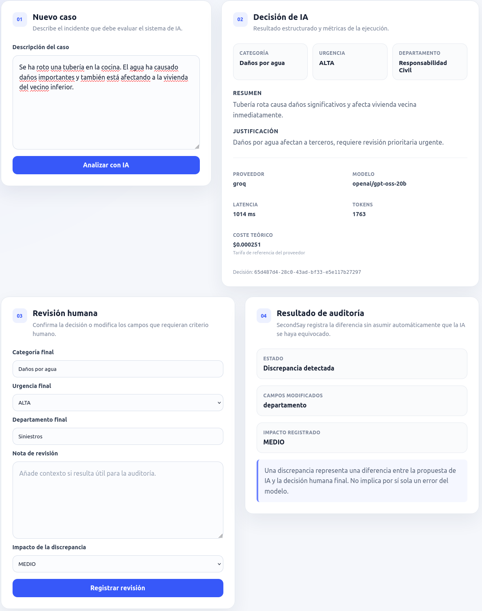
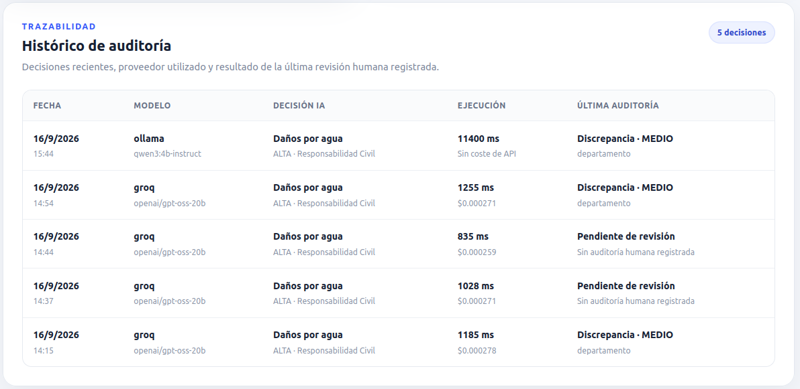
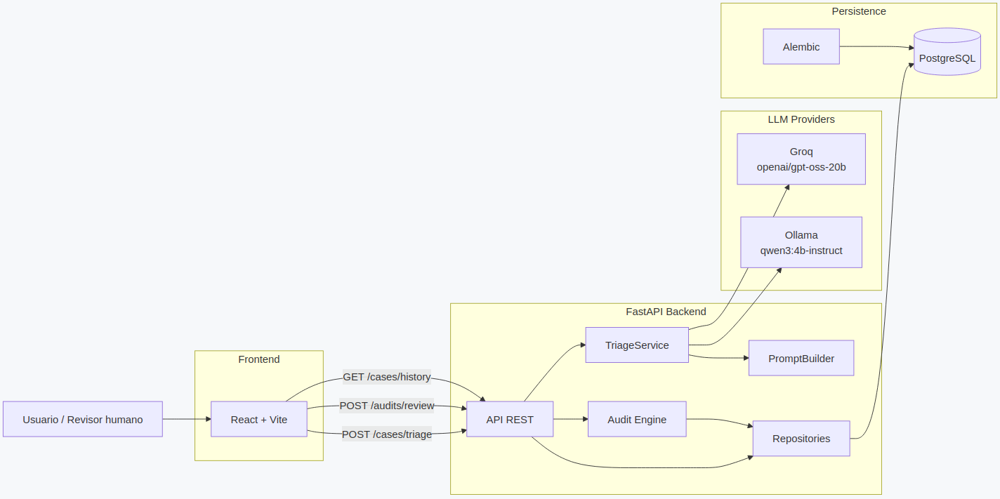
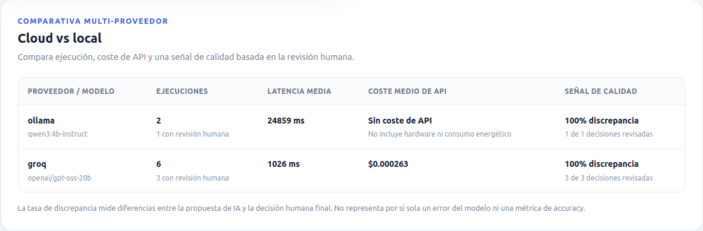

# SecondSay

SecondSay es una plataforma de **auditoría continua de decisiones de inteligencia artificial**.

Su objetivo no es sustituir a los sistemas de IA que toman o proponen decisiones, sino observar su comportamiento, registrar sus resultados, compararlos con la decisión humana final y convertir esas discrepancias en información útil para mejorar calidad, control y trazabilidad.

> ¿Qué está haciendo nuestra IA, dónde discrepa de nuestros expertos y qué podemos aprender de esas diferencias?

## Problema que resuelve

Cuando una organización incorpora IA en un flujo operativo con supervisión humana, necesita responder preguntas como:

- ¿Cuándo modifica una persona la decisión propuesta por la IA?
- ¿Qué campos cambia?
- ¿Qué impacto tiene esa discrepancia?
- ¿Qué modelo o proveedor produjo la decisión?
- ¿Cuánto tardó la inferencia?
- ¿Cuántos tokens consumió?
- ¿Qué coste teórico tuvo?
- ¿Qué diferencias existen entre una opción cloud y una opción local?

SecondSay proporciona una capa neutral de auditoría sobre esos sistemas.

Una discrepancia **no implica automáticamente que la IA se haya equivocado**. La decisión humana puede cambiar por contexto adicional, políticas internas, criterios operativos o información que el modelo no tenía disponible.

## Caso de uso de demostración

La demo actual utiliza un perfil de dominio de **seguros y siniestros**.

Los casos permiten trabajar con decisiones estructuradas como:

- categoría;
- urgencia;
- departamento responsable;
- resumen;
- justificación.

La arquitectura está diseñada para que el núcleo de auditoría no dependa del dominio de seguros.

## Flujo actual

```text
Caso
  ↓
Proveedor LLM
  ↓
Decisión estructurada
  ↓
Métricas de ejecución
  ↓
PostgreSQL
  ↓
Revisión humana
  ↓
Audit Engine
  ↓
Discrepancia + impacto
  ↓
PostgreSQL
  ↓
Histórico de auditoría
```

## Funcionalidades implementadas

### Inferencia con IA real

SecondSay soporta actualmente dos rutas de inferencia:

**Cloud**

```text
Groq
└── openai/gpt-oss-20b
```

**Local**

```text
Ollama
└── qwen3:4b-instruct
```

La lógica de aplicación depende de una abstracción común de proveedor, por lo que el flujo de negocio no está acoplado a Groq u Ollama.

### Structured outputs

Las decisiones generadas por los modelos pasan por:

* JSON Schema;
* validación Pydantic;
* contrato estructurado común;
* validaciones semánticas adicionales.

El modelo local dispone además de un segundo intento correctivo cuando devuelve una respuesta estructural o semánticamente inválida.

El proveedor cloud incorpora retry/backoff ante errores HTTP recuperables.

### Human Review

Una persona puede revisar:

* categoría;
* urgencia;
* departamento.

La revisión humana referencia la decisión IA persistida mediante su UUID.

El cliente no puede sustituir la decisión original antes de auditarla: SecondSay recupera esa decisión directamente desde PostgreSQL.

### Audit Engine

El motor de auditoría compara la propuesta de IA con la decisión humana final.

Registra:

* existencia o no de discrepancia;
* campos modificados;
* impacto de la discrepancia.

Impactos disponibles:

```text
BAJO
MEDIO
ALTO
CRÍTICO
```

Los cambios en resumen o justificación no se consideran actualmente discrepancias operativas.

### Persistencia y trazabilidad

SecondSay utiliza PostgreSQL, SQLAlchemy y Alembic.

Tablas principales:

```text
cases
ai_decisions
audits
```

Cada decisión IA conserva también:

* proveedor;
* modelo;
* tokens de entrada;
* tokens de salida;
* latencia;
* coste estimado;
* fecha de ejecución.

Una decisión puede recibir varias revisiones humanas.

### Histórico de auditoría

La interfaz incluye una vista histórica basada en los datos persistidos.

Para cada decisión muestra, entre otros datos:

* fecha;
* proveedor;
* modelo;
* categoría;
* urgencia;
* departamento;
* latencia;
* coste de API o coste teórico;
* estado de revisión;
* impacto de discrepancia;
* campos modificados.

Cuando existen varias auditorías sobre una misma decisión, el histórico muestra la revisión más reciente.

## Cloud vs local

SecondSay permite demostrar un trade-off real entre infraestructura cloud y local.

El operador puede seleccionar **Cloud · Groq** o **Local · Ollama** para cada
ejecución desde la interfaz, sin reiniciar el backend.

El dashboard agrega además los registros persistidos por proveedor/modelo para
comparar:

* número de ejecuciones;
* latencia media;
* coste medio de API;
* decisiones revisadas;
* tasa de discrepancia en decisiones revisadas como señal de alineación con la revisión humana.

La tasa de discrepancia no representa por sí sola un error del modelo ni una
métrica de accuracy.

### Groq

Ventajas principales:

* baja latencia;
* infraestructura gestionada;
* modelo cloud disponible mediante API.

El coste mostrado en la aplicación es un **coste teórico calculado a partir de una tarifa de referencia**, no evidencia de facturación real.

### Ollama

Ventajas principales:

* ejecución dentro de infraestructura local;
* mayor control sobre los datos;
* ausencia de coste directo de API.

La interfaz muestra:

```text
Sin coste de API
```

Esto no significa que hardware, electricidad o infraestructura tengan coste cero.

En las pruebas realizadas sobre el hardware local del proyecto, Groq ha mostrado latencias próximas a un segundo, mientras que Ollama con `qwen3:4b-instruct` ha requerido varios segundos por ejecución.

El objetivo de la opción local no es superar a un proveedor cloud en velocidad, sino ofrecer otro equilibrio entre:

* privacidad;
* control de infraestructura;
* coste de API;
* latencia.

## Stack tecnológico

### Backend

* Python 3.12
* FastAPI
* Pydantic 2
* SQLAlchemy 2
* PostgreSQL
* Psycopg 3
* Alembic
* HTTPX
* PyYAML
* Pytest
* Ruff

### Frontend

* React 19
* JavaScript
* Vite 8
* ESLint

No se utilizan actualmente TypeScript, Tailwind CSS, shadcn/ui ni una librería externa de componentes.

### IA

Cloud:

```text
Groq
openai/gpt-oss-20b
```

Local:

```text
Ollama
qwen3:4b-instruct
```

## API principal

### Crear y analizar un caso

```http
POST /api/v1/cases/triage
```

Realiza la inferencia, persiste el caso y la decisión IA y devuelve los UUID de trazabilidad.

### Registrar una revisión humana

```http
POST /api/v1/audits/review
```

Recibe el identificador de una decisión IA y la revisión humana, ejecuta el Audit Engine y persiste el resultado.

### Consultar el histórico

```http
GET /api/v1/cases/history
```

Devuelve las decisiones persistidas junto con la última auditoría asociada cuando existe.

## Perfil de dominio

El perfil actual de seguros se encuentra en:

```text
domain-profiles/insurance/
├── profile.yaml
├── rules.yaml
├── few_shots.yaml
└── anti_bias.yaml
```

El `PromptBuilder` utiliza esta configuración para construir el contexto que reciben los modelos.

## Estructura del repositorio

```text
SecondSay/
├── backend/
│   ├── app/
│   │   ├── api/
│   │   ├── core/
│   │   ├── domain/
│   │   ├── models/
│   │   ├── providers/
│   │   ├── repositories/
│   │   ├── schemas/
│   │   └── services/
│   ├── migrations/
│   └── tests/
│
├── frontend/
│   └── src/
│
├── domain-profiles/
│   └── insurance/
│
├── data/
├── docs/
├── external-simulator/
├── infra/
└── scripts/
```

`external-simulator/`, `infra/` y `scripts/` están actualmente preparados como estructura de proyecto, pero no contienen todavía funcionalidades operativas.

Las carpetas de `data/` están preparadas para futuros datasets reales, sintéticos, de demostración o procedentes de fuentes externas.

## Configuración

Copia el archivo de ejemplo:

```bash
cp .env.example .env
```

Configura localmente las variables necesarias.

Ejemplo de modos disponibles:

```env
LLM_MODE=cloud
```

o:

```env
LLM_MODE=local
```

Para cloud:

```env
CLOUD_LLM_PROVIDER=groq
CLOUD_LLM_API_KEY=
CLOUD_LLM_MODEL=openai/gpt-oss-20b
```

Para local:

```env
LOCAL_LLM_PROVIDER=ollama
LOCAL_LLM_MODEL=qwen3:4b-instruct
LOCAL_LLM_BASE_URL=http://127.0.0.1:11434
```

No deben almacenarse API keys, contraseñas ni otros secretos reales en Git.

## Ejecución local

### Requisitos

* Python 3.12 o superior
* PostgreSQL
* Node.js 20 o superior
* npm
* Ollama, únicamente si se quiere utilizar el modo local

### Backend

```bash
cd backend
pip install -e ".[dev]"
alembic upgrade head
uvicorn app.main:app --reload
```

API por defecto:

```text
http://127.0.0.1:8000
```

### Frontend

En otra terminal:

```bash
cd frontend
npm install
npm run dev
```

Interfaz de desarrollo:

```text
http://localhost:5173
```

Vite redirige las peticiones:

```text
/api → http://127.0.0.1:8000
```

## Calidad y tests

Backend:

```bash
cd backend
pytest -q
ruff check .
```

Última validación local:

```text
62 passed, 3 warnings
All checks passed!
```

Frontend:

```bash
cd frontend
npm run lint
npm run build
```

Ambos comandos se encuentran actualmente validados sin errores.

## Qué demuestra actualmente SecondSay

La versión actual permite demostrar de extremo a extremo:

```text
Caso
→ selección Cloud · Groq o Local · Ollama
→ decisión estructurada
→ métricas
→ persistencia
→ revisión humana
→ auditoría
→ persistencia
→ histórico
```

Esto convierte a SecondSay en algo distinto de una simple aplicación que llama a un chatbot: la propuesta central es una capa de **AI Quality, Human-in-the-loop y AI Governance operacional**.

## Evidencias visuales

### Flujo de auditoría

Decisión estructurada de IA, revisión humana y resultado de auditoría:



### Histórico de auditoría

Persistencia de decisiones, proveedores, modelos, latencias, coste y discrepancias:



### Arquitectura

Vista general de la arquitectura modular de SecondSay:



### Comparativa cloud vs local

Comparación agregada entre Groq y Ollama en ejecuciones, latencia, coste de API
y discrepancia observada tras revisión humana:




## Roadmap

Las siguientes capacidades forman parte de la evolución prevista y **no deben considerarse implementadas actualmente**:

* entrada multimodal basada en imágenes;
* simulador de sistema externo;
* detección automática de patrones;
* analítica histórica avanzada;
* Evaluation Lab para benchmarking automático entre modelos;
* comparación simultánea cloud/local;
* replay de casos históricos;
* AI regression testing;
* despliegue público.

## Visión de producto

Una organización puede tener uno o varios modelos tomando o proponiendo decisiones.

SecondSay no pretende sustituirlos.

Su función es situarse como una capa de control entre los sistemas de IA y los equipos humanos para aportar:

* trazabilidad;
* supervisión;
* evidencia;
* comparación;
* aprendizaje continuo.

```text
Sistemas de IA
      ↓
   SecondSay
      ↓
Equipos humanos
Calidad
Operaciones
Governance
```

---

Proyecto desarrollado como trabajo final de un bootcamp de desarrollo e ingeniería aplicada a inteligencia artificial.
