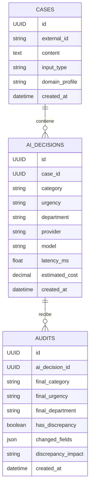

# Arquitectura de SecondSay

SecondSay está construido como un **monolito modular** con separación clara entre API, dominio, proveedores LLM, persistencia y frontend.

El objetivo es mantener una arquitectura suficientemente profesional para una demo y un producto real, sin introducir complejidad innecesaria.

## Vista general

```mermaid
flowchart LR
    U[Usuario / Revisor humano]

    subgraph Frontend
        UI[React + Vite]
    end

    subgraph Backend["FastAPI Backend"]
        API[API REST]
        TRIAGE[TriageService]
        PROMPT[PromptBuilder]
        AUDIT[Audit Engine]
        REPO[Repositories]
    end

    subgraph Providers["LLM Providers"]
        GROQ[Groq\nopenai/gpt-oss-20b]
        OLLAMA[Ollama\nqwen3:4b-instruct]
    end

    subgraph Persistence
        DB[(PostgreSQL)]
        ALEMBIC[Alembic]
    end

    U --> UI
    UI -->|POST /cases/triage| API
    UI -->|POST /audits/review| API
    UI -->|GET /cases/history| API

    API --> TRIAGE
    TRIAGE --> PROMPT
    TRIAGE --> GROQ
    TRIAGE --> OLLAMA

    API --> AUDIT

    API --> REPO
    AUDIT --> REPO
    REPO --> DB

    ALEMBIC --> DB
````

## Flujo end-to-end

```mermaid
sequenceDiagram
    actor User as Usuario
    participant UI as React
    participant API as FastAPI
    participant LLM as Groq / Ollama
    participant DB as PostgreSQL
    participant Audit as Audit Engine

    User->>UI: Introduce un caso
    UI->>API: POST /api/v1/cases/triage
    API->>LLM: Prompt + schema estructurado
    LLM-->>API: Decisión + métricas

    API->>DB: Persistir caso
    API->>DB: Persistir decisión IA
    API-->>UI: Decisión + UUID + métricas

    User->>UI: Revisión humana
    UI->>API: POST /api/v1/audits/review
    API->>DB: Recuperar decisión IA original
    API->>Audit: Comparar IA vs humano
    Audit-->>API: Discrepancia + impacto
    API->>DB: Persistir auditoría
    API-->>UI: Resultado de auditoría

    UI->>API: GET /api/v1/cases/history
    API->>DB: Consultar decisiones + última auditoría
    DB-->>API: Histórico
    API-->>UI: Histórico de auditoría
```

## Capas principales

### Frontend

Tecnologías:

* React 19
* JavaScript
* Vite 8
* ESLint

Responsabilidades:

* creación de casos;
* visualización de decisiones IA;
* métricas de ejecución;
* Human Review;
* resultado de auditoría;
* histórico de decisiones y revisiones.

### API

FastAPI expone actualmente tres operaciones principales:

```text
POST /api/v1/cases/triage
POST /api/v1/audits/review
GET  /api/v1/cases/history
```

La API coordina servicios, repositorios y validación de contratos.

### Servicios

`TriageService` depende de la abstracción `LLMProvider`.

Esto permite utilizar distintos proveedores sin cambiar la lógica de negocio.

Actualmente:

```text
cloud → Groq
local → Ollama
```

### PromptBuilder

Construye el prompt a partir del perfil de dominio.

Perfil actual:

```text
domain-profiles/insurance/
```

Incluye:

* reglas;
* few-shot examples;
* configuración del dominio;
* consideraciones anti-bias.

### Proveedores LLM

#### Groq

```text
openai/gpt-oss-20b
```

Características:

* structured output;
* JSON Schema;
* validación Pydantic;
* retry/backoff;
* métricas de tokens;
* latencia;
* coste teórico.

#### Ollama

```text
qwen3:4b-instruct
```

Características:

* ejecución local;
* structured output;
* validación Pydantic;
* retry correctivo;
* métricas agregadas;
* sin coste directo de API.

### Audit Engine

Compara:

```text
categoría
urgencia
departamento
```

No considera actualmente `summary` ni `justification` como discrepancias operativas.

Produce:

* `has_discrepancy`;
* `changed_fields`;
* impacto de discrepancia.

Una discrepancia no implica automáticamente que la IA se haya equivocado.

### Persistencia

Tecnologías:

* PostgreSQL
* SQLAlchemy 2
* Psycopg 3
* Alembic

Tablas principales:

```text
cases
ai_decisions
audits
```

Relaciones conceptuales:



## Cloud vs local

SecondSay permite ejecutar la misma vertical mediante dos estrategias:

```text
Groq
→ menor latencia
→ infraestructura cloud
→ coste teórico por uso

Ollama
→ ejecución local
→ mayor control y privacidad
→ sin coste directo de API
→ mayor latencia en el hardware actual
```

La interfaz permite seleccionar `cloud` o `local` para cada ejecución.

El endpoint de triaje acepta el parámetro opcional:

```text
llm_mode=cloud|local
````

Si no se especifica, se conserva como fallback el modo configurado en el backend.
La construcción concreta del proveedor continúa centralizada en `LLMProvider` y
su factoría.

## Decisiones de arquitectura

### Monolito modular

Se ha evitado introducir microservicios porque no aportan valor suficiente al alcance actual.

La prioridad es mantener:

* separación de responsabilidades;
* testabilidad;
* claridad;
* facilidad de demo;
* capacidad de evolución.

### Abstracción de proveedor

La lógica de negocio depende de:

```text
LLMProvider
```

y no directamente de Groq u Ollama.

Esto permite sustituir o añadir proveedores sin reescribir `TriageService`.

### Persistencia de la decisión original

La revisión humana envía:

```text
ai_decision_id
```

El backend recupera la decisión original desde PostgreSQL.

Esto evita que el cliente pueda sustituir la decisión IA que se pretende auditar.

## Estado actual vs roadmap

### Implementado

* FastAPI;
* Groq;
* Ollama;
* structured outputs;
* PostgreSQL;
* Alembic;
* Human Review;
* Audit Engine;
* React;
* histórico;
* métricas;
* selector cloud/local por ejecución;

* comparativa histórica básica por proveedor/modelo.

### No implementado todavía

* multimodalidad por imagen;
* simulador externo;
* Pattern Detection;
* Evaluation Lab;
* comparación simultánea cloud/local;
* replay histórico;
* deploy público.

Estas capacidades pertenecen al roadmap y no forman parte de la arquitectura operativa actual.
